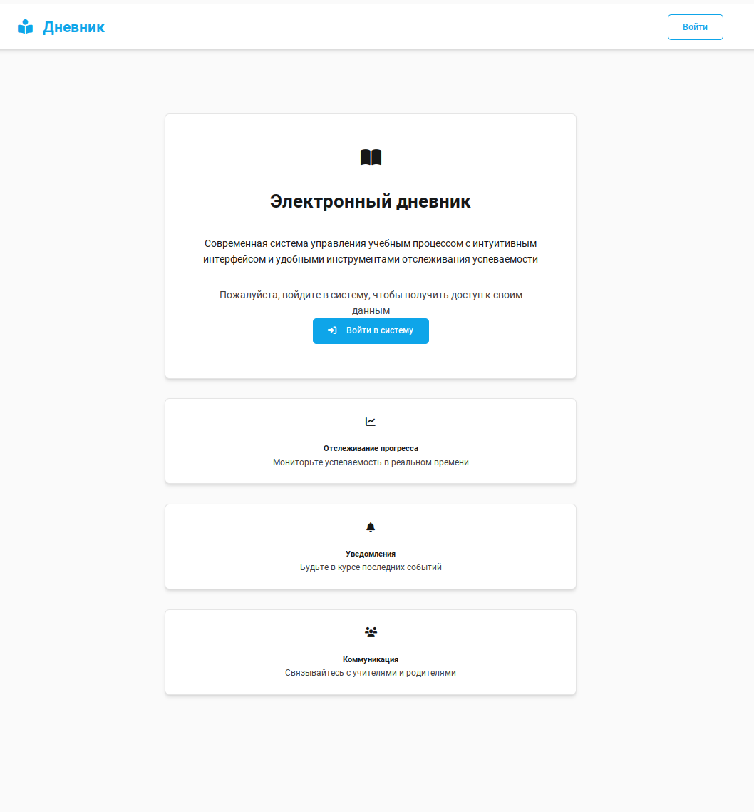
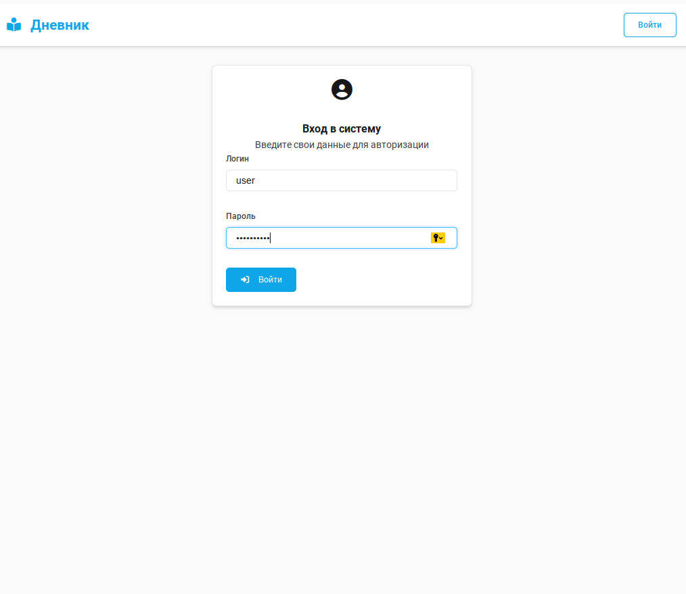
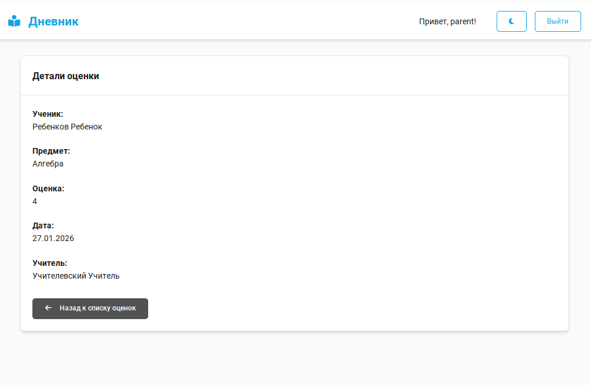
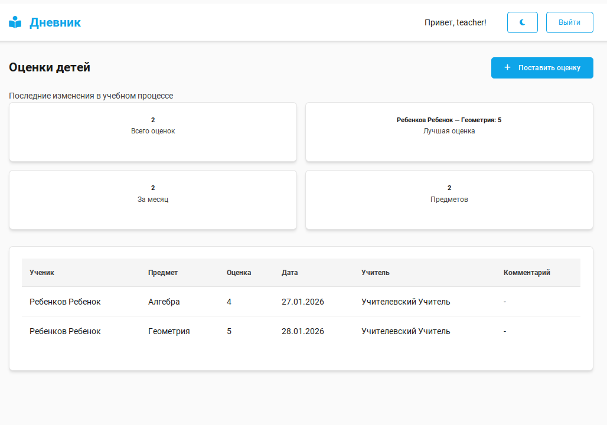
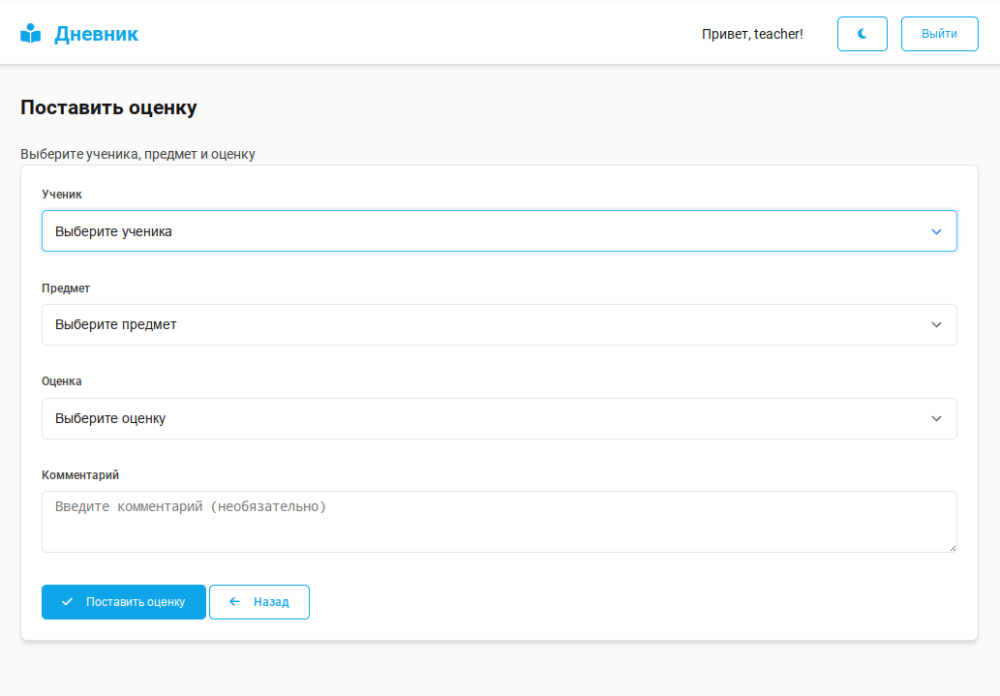

# Электронный дневник

Проект "Электронный дневник" - это веб-приложение для управления успеваемостью учащихся.

## Описание

Система позволяет учителям, ученикам и родителям отслеживать и управлять успеваемостью учащихся. Приложение предоставляет интерфейс для добавления, просмотра и анализа оценок с поддержкой темной/светлой темы и адаптивного дизайна.

## Особенности

- **Доступ для разных ролей**: Учителя, ученики и родители имеют разный уровень доступа к информации
- **Добавление оценок**: Учителя могут выставлять оценки ученикам с комментариями
- **Просмотр оценок**: Каждый пользователь видит только свою информацию
- **Темная/светлая тема**: Переключение между темами с сохранением настроек
- **Адаптивный дизайн**: Интерфейс работает на различных устройствах

## Скриншоты







## Структура проекта

```
diary/
├── diary/              # Основной проект Django
│   ├── settings.py     # Настройки проекта
│   ├── urls.py         # Основные маршруты
│   └── ...
├── journal/            # Приложение для работы с оценками
│   ├── models.py       # Модели данных (Ученик, Учитель, Оценка и т.д.)
│   ├── views.py        # Логика представлений
│   ├── urls.py         # Маршруты приложения
│   └── ...
├── templates/          # Шаблоны HTML
│   ├── base.html       # Базовый шаблон
│   ├── journal/        # Шаблоны модуля журнала
│   └── registration/   # Шаблоны авторизации
├── static/             # Статические файлы
│   └── css/            # Стили
└── manage.py           # Командная строка Django
```

## Модели данных

- **Subject** - Предмет
- **SchoolClass** - Класс
- **Student** - Ученик
- **Parent** - Родитель
- **Teacher** - Учитель
- **Grade** - Оценка (связана с учеником, предметом, учителем, значением и комментарием)

## Функционал

### Для учителей:
- Вход в систему
- Просмотр своих оценок
- Добавление новых оценок ученикам
- Просмотр деталей оценки

### Для учеников:
- Вход в систему
- Просмотр своих оценок
- Просмотр деталей оценки

### Для родителей:
- Вход в систему
- Просмотр оценок своих детей
- Просмотр деталей оценки

## Требования

- Python 3.8+
- Django 4.x
- SQLite (по умолчанию)

## Установка

1. Клонировать репозиторий
2. Создать виртуальное окружение: `python -m venv venv`
3. Активировать виртуальное окружение: `source venv/bin/activate` (Linux/Mac) или `venv\Scripts\activate` (Windows)
4. Установить зависимости: `pip install -r requirements.txt`
5. Выполнить миграции: `python manage.py migrate`
6. Создать суперпользователя: `python manage.py createsuperuser`
7. Запустить сервер: `python manage.py runserver`

## Использование

1. Запустить сервер командой `python manage.py runserver`
2. Открыть браузер и перейти по адресу `http://127.0.0.1:8000/`
3. Войти в систему с учетными данными пользователя
4. Использовать соответствующие функции в зависимости от роли пользователя

## Автор

Разработчик: Александр

## Лицензия

Этот проект предоставляется "как есть" и может свободно использоваться при обязательном указании авторства.

## Предложения и обратная связь

Если у вас есть предложения по улучшению проекта, вы можете связаться с автором:
- Электронная почта: pwork71@ya.ru
- Telegram: [написать](https://aps71.t.me)

## Поддержать проект

- Поддержка: [Купить кофе разработчику](https://donatepay.ru/don/1462628)